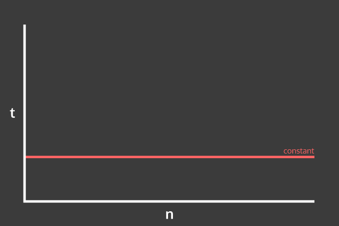
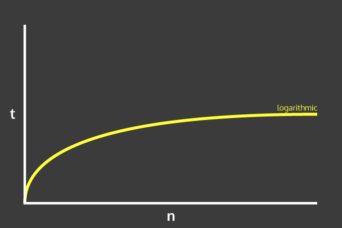
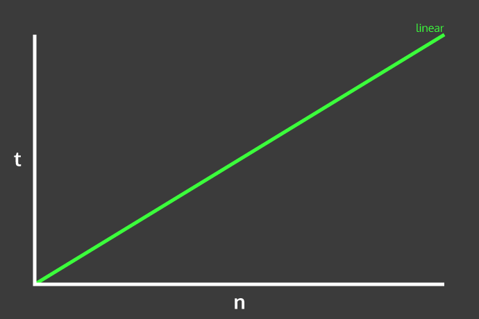
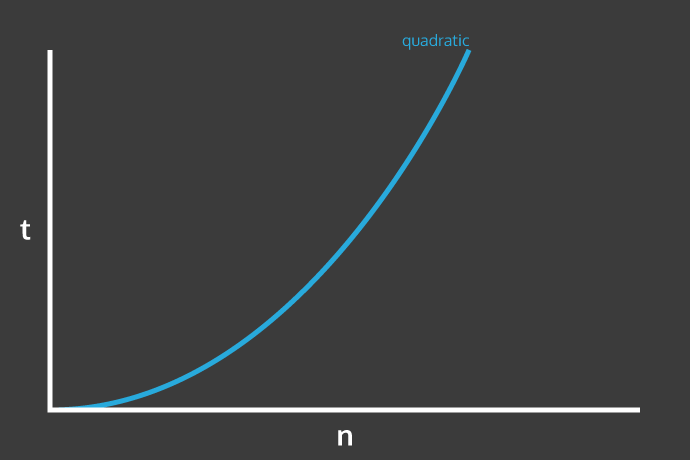
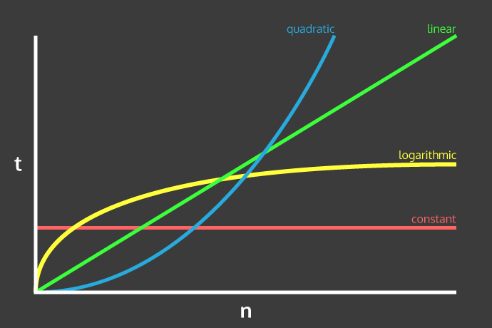

# Complexity Analysis & Why It's Important

Let's talk about the topic of time complexity, and how to analyze it. Time complexity has become more and more important on my quest for mastery of the full JavaScript stack, and it also strikes some chords in the mathematical parts of my brain. I believe it's such an important topic to have at least a basic grasp of, no matter what your direction and project approach may be. 

As a front-end developer working on smaller projects, computer science topics like time complexity analysis may never enter your frame at all. But as the size, scope, and scale of a project changes and grows, it must. As I mentioned above, I'm on a quest to get to a higher skill and thinking level, so this is now important to me. Below are my musings, alongside some final conclusions.

## Ask Yourself This

Before diving in to time complexity, let's present a little question.

> How does the problem size affect the time and space required by a particular algorithm?

First, let's define an algorithm. An algorithm is a series of steps taken to arrive at a solution. Some common examples might be:

* Steps taken to solve a Rubiks cube
* Proposed directions on a map

You can easily imagine that we're faced with algorithmic procedures in our every day lives. Sometimes, though, there are many ways to arrive at a destination or solution. Some might require more steps but might be more efficient, some might require less steps, but each step will take some time. This is time complexity perfectly abstracted into real life. Let's port this way of thinking over to software development.

##Complexity Analysis & Software Development

As I mentioned before, time complexity becomes an extremely important issue when the scale of an application grows. Complexity analysis helps us understand and improve the efficiency of our code. Let's draft up a little problem.

Imagine that we want to find the largest difference in a list of numbers. The system that we use to arrive at this is an algorithm, as described above. The bigger the problem, the longer it will take. But as the size of the problem gets bigger and bigger, the cost (efficiency) might get higher, a little higher, or not higher at all. Sometimes it just won't get any more complicated (which is good). Let's analyze our example with 3 possible scenarios:

1. Assuming that the array is sorted, comparing the first and last numbers will always result in the largest difference. No matter how much the input size grows, we will always only ever have to perform three operations - finding the first item, finding the last item, and finding the difference. This can be considered a constant time operation.
2. Assuming the array wasn't sorted, we could also potentially go through every item in the array, keeping track of the smallest and largest numbers. Once we've gone through the whole array, we would then be able to calculate the largest difference. Here, the time taken to complete the operation is directly proportional to the size of the input. That is, as the size of the input grows, the time to completion also grows in a 1:1 manner. This is considered a linear time operation.
3. For the sake of painting a clear picture, let's demonstrate a third method. Imagine that we were looping over our array of input, and comparing every number to the other. In that case, we might be in some kind of nested for-loop situation. As the size of the input grows, we are performing n*n operations, where n is the size of the input. That can be considered a quadratic time operation.

This is complexity analysis in action. Constant time operations are ideal, but not always attainable. It's up to you to really determine the tradeoffs in code complexity and time complexity based on the problem, but a basic knowledge in time complexity can at least get you on the right track.

## Big O Notation

The Big-O notation is used to describe time complexity (an approximation), and the worst case performance for large n. It uses general "complexity types", not equations. Some of the Big-O notations are:

1. **O(1)** - constant time
2. **O(log n)** - logarithmic time
3. **O(n)** - linear time
4. **O(n^2)** - quadratic time
5. **C^(O(n))** - exponential time (where C is a coefficient or constant)

Approximations (as opposed to equations) allow us to simplify the quick analysis of a problem to get some instant clarity on time complexity. In other words, 2n (let's call 2 the coefficient) would still be considered a linear time operation, and would fall under the O(n) notation. If you're wondering why, then consider this. If we had an input size of n = 1,000,000, and we had to compare O(n) to O(n^2), would the coefficient really play a significant role in the overall time to completion? The answer is no.

Let's run through some examples and graphs to help determine the complexity type.

## Determining The Complexity Type

When determining the complexity type, all we need to do is think about the bigger picture:

* What is a specific algorithm doing?
* How will it behave at large n?

Once we strip out the excesses and consider the above two points, determining it is easy. Let's look at the four most common time complexities, and demonstrate them with real world examples and graphs.

### Constant Time Complexity

Constant time, as mentioned above, means that algorithm completion time is not affected by the size of the input. Here are some examples:

1. Array lookup given an index
2. Hash table insertion

### Logarithmic Time Complexity

If you've ever seen a logarithmic graph, you'll know that as n increases, the difference between log(n) and log(n-1) decreases. In software terms, that's equivalent to saying that as the input size grows, the time to completion increases by a smaller amount than the previous input relationship. Here's an example:

1. Binary search

### Linear Time Complexity

As I mentioned before, a linear time operation exhibits a 1:1 relationship between size of input an time to completion. That is, as the size of the input grows, the time to completion increases linearly. Here's an example:

1. Iterating over an array with a `for` loop.

### Quadratic Time Complexity

Finally, let's touch on quadratic time. Quadratic time complexity means that as input size (n) grows, the time to completion grows in an n*n (or n^2) fashion. Here are some examples:

1. Bubble sorting
2. A nested for loop

Let's think about two nested for loops, and why it results in a quadratic time operation. The inner operation might be constant, but the first wrapping `for` loop is linear, i.e. an O(n) operation. The inner `for` loop presents a second O(n) operation. O(n)[O(n)] can be approximated to O(n^2), i.e. a quadratic operation. Small inputs are OK, but complexity increases greatly as inputs get large. Be mindful!

## A Consolidated Visual

For a quick look at an approximation of the above 4 time complexities, here's a consolidated visual for you.

## Wrap Up

With a basic understanding of time complexity, you'll be able to perform your own analysis on your algorithms and functions pretty quickly. It's a great way to incorporate some theoretical processes into your day to day thinking as you build applications and software. Remember, complexity analysis isn't just about achieving the fastest algorithmic time-to-completion possible. It's about understanding the problem, the size of the input, and ultimately using what's best for the given scenario.

I hope you gained a bit of insight here, and thanks for reading! Feel free to leave any comments or questions down below.

## Handy References

* [The Big O cheat sheet](http://bigocheatsheet.com/)